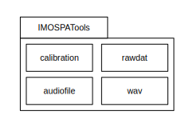
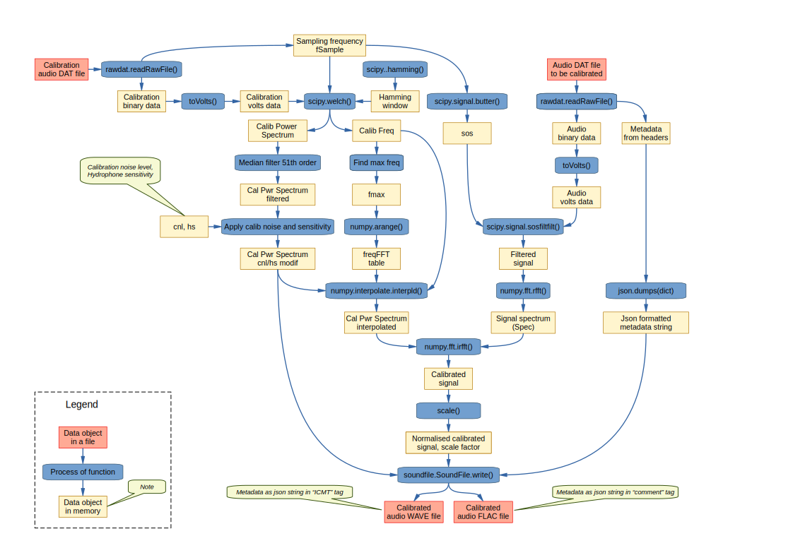

======================
IMOS PA Tools
======================

IMOS Passive Audio Tools Documentation
-----------------------------------------------------------------

This software contains of a Python library package IMOAPATools and a set of CLI tools that serve also as a demo code how to use the library.

It is recommended to install the package with pip in a virtual environment (eg miniconda), or in a container.

Repository structure
--------------------
  
   .. code-block::
  
      NDRI-IMOS
      ├── doc          ... documentation
      ├── IMOSPATools  ... the Python library code
      ├── jupyter      ... Jupyter notebooks to compare calibration result with reference implementation
      ├── scripts      ... CLI tools
      ├── src
      │   ├── matlab   ... the reference matlab implementation of calibration
      │   └── utils
      │       └── imos_read  ... simple C code to read .DAT file
      └── tests        ... test procedures
         └── data      ... test data
               ├── KI_3501
               │   ├── Calib_file
               │   └── reference
               ├── Portland_3092
               │   ├── Calib_file
               │   └── reference
               └── Rottnest_3154
                   ├── Calib_file
                   └── reference
         
   .. ::

Static design
-------------

The static design diagram shows the breakdown of the library into code modules.

* rawdat 
    routines to read the raw (.DAT) files.
* calibration
    routines to read and pre-process the calibration file, 
    and to calibrate the actual audio records.
* audiofile 
    routines to write audio record (output of the calibration) into 
    a file in WAV or FLAC format. Definition of structures for IMOS 
    specific meta data. Handling and conversions of metadata format.
    This code is based on "soundfile' package.
* wav
    simple module to write MS WAVE files (uses python package 'wave'),
    does not support IMOS specific metadata handling.

Dynamic design
--------------

The calibration dataflow diagram shows processing steps and intermediate 
data products through the procedure of calibration.

CLI tools included
------------------

Commandline tools 

* dat2wav.py 
    commandline script that is able to read one raw (.DAT) file,
    calibrate it and save the product to a file as Microsoft WAVE
    or loselessly compressed FLAC

* inspect_audio_record.py
    commandline script that read the wav or flac file 
    and prints various information on the data recorrd,
    including IMOS meta data (if included in the file).
   
Testing
-------
Automated end-to-end integration test using pytest is included in the github repo.
All test* functions in code modules matching pattern test*.py in sub-folder 'tests' 
are automatically executed in Python 3.8.latest and 3.9.latest on Github when 
git push or pull request actions are taken.

Verification
------------
Jupyter notebooks calling IMOAPATools library combined with code copied from the library 
calibration module are used to verify the correctness of the calibration, compared 
to the product of the reference implementation. The comparison is done at the stage 
of normalised calibrated signal.

Technical notes
----------------

The code is based on commonly used Python libraries included in packages numpy and scipy.
Scipy as of 07/2024 does not support Python versions later than 3.9 and this fact
restricts the usability of this code to the same Python version.

The Butterworth high pass filter introduces frequency dependant phase delay. This is 
compensated by using forward-backward filtering, as this calibration is post-processing,
rather than real-time operation. In the scipy implementation, the initial approx 0.1s
at the beginning of the calibrated audio record has a bit of artefact visible when 
inspecting the waveform, which is not present when using the matlab implementation.
After approx 0.2s this fades out completely and is not noticeable.

The fast fourier transformation eventually used in the code is "real signal" FFT, which
ensures that no numerical residuals of complex component need to be explicitly removed 
from the product of inverse FFT.

Based on consultation with an expert who has extensive experience with the actual dataset, 
this library supports only single channel passive audio records - simple because there are
no multi channel data files.
